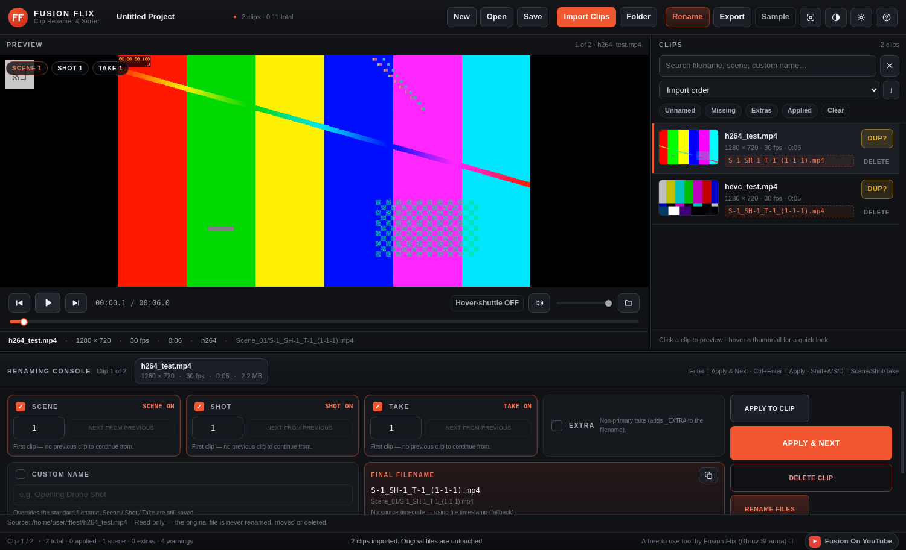
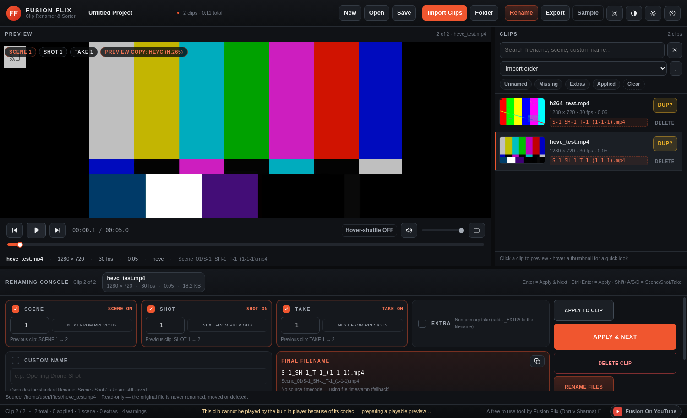

<div align="center">

# FUSION FLIX — CLIP RENAMER &amp; SORTER

**Organize your footage. One clip at a time.**

A free, offline Windows desktop app for filmmakers, editors and creators:
import hundreds of clips, preview and hover-scrub them, tag **Scene / Shot / Take**,
rename, sort, and export renamed copies anywhere — **without ever touching your originals.**

**A free to use tool by Fusion Flix (Dhruv Sharma) 💓**
[YouTube — @fusiononyoutube](https://youtube.com/@fusiononyoutube)

</div>

---

## ⬇️ Download &amp; install

**➡️ [Download the latest installer (Windows 64-bit)](https://github.com/DhruvEditWorks/FusionFlix-Clips-Renamer/releases/latest)**

The file is called `Fusion Flix Clip Renamer & Sorter Setup.exe` (~90 MB).

1. Run the installer and choose a folder (a normal user install, no admin rights needed).
2. When it asks **“Download the media engine (FFmpeg) now?”** → choose **Yes**.
   That engine is what lets the app build **previews and thumbnails of camera footage**
   (HEVC/H.265, ProRes, 10-bit…). You can also add it later from
   **Settings → Media engine → Download FFmpeg**.
3. Windows SmartScreen may say “Windows protected your PC” (the installer is not
   code-signed). Click **More info → Run anyway**.

Everything works **offline**. The only thing that ever uses the internet is the optional
FFmpeg download (at install time or from Settings).

---

## 📸 Screenshots

| Player left · clip list right · renaming console below | Any codec, previewed |
| --- | --- |
|  |  |

---

## ✨ What it does

| Area | What is implemented |
| --- | --- |
| **Import** | multi-file, whole folders (recursive), drag &amp; drop files *or* folders, hundreds of clips, live progress, per-file warnings, unreadable files are reported and skipped |
| **Clip browser** | virtualised list (smooth at 1000+ clips), thumbnails, duration · resolution · FPS · timecode, Scene/Shot/Take/EXTRA/NAME badges, status chips, search, sort by import order / Scene / Shot / Take / filename, filters (Unnamed · Missing · Extras · Applied) |
| **Preview** | one large player, play/pause, previous/next clip, draggable timeline, current + total time, mute, volume, full screen; hovering a clip loads it into the player |
| **Hover shuttle** | move the mouse left/right over the player to scrub — distance sets the speed **0.25× → 0.5× → 1× → 2× → 4× → 8×**, forward *and* backward, smooth (switchable, **off by default**) |
| **Tagging** | independent **Scene / Shot / Take** (switch + number + “NEXT FROM PREVIOUS”), **EXTRA**, **CUSTOM NAME** (keeps S/SH/T in the project), live **FINAL FILENAME**, validation with `_01` / `_02` auto-resolution — nothing is ever overwritten silently |
| **Naming** | `S-1_SH-5_T-15_(1-5-15).mp4` — the bracket repeats Scene, Shot and Take (a switched-off tag shows `0`); `…_EXTRA_(1-5-15).mp4` for extras; a custom name replaces the whole thing |
| **Rename** | renames your files **in place** with a real-time percentage, fully undoable |
| **Export** | a plain **copy**: every clip is copied to the destination you pick under its new name. Nothing is re-encoded, no hard links, no report files. Two layouts — **straight into the folder** (default) or **Scene folders** (`Scene_01/…`, never Shot/Take) |
| **Project** | `.ffclip` save / open / save as (paths + metadata + settings only — **never a copy of your video**), autosave with crash recovery, **Relink missing media**, undo/redo |
| **Safety** | sources are read-only, deletes ask first and never touch disk, pre-export checks (duplicates, missing sources, space, destination), friendly error dialogs with Retry / Skip / Cancel |
| **Performance** | thumbnail cache, lazy loading, list virtualisation, background FFmpeg, low-memory preview — never decodes all videos at once |

---

## 🎬 Preview of camera codecs (why FFmpeg is recommended)

Normal Windows video playback only understands H.264, VP9 and AV1. Camera footage is
usually **HEVC/H.265, ProRes, DNxHD or 10-bit** — which is exactly why so many
“the preview is empty” stories exist in every editing app.

This app handles it in two steps:

1. If Windows itself can decode the clip (hardware HEVC), it plays natively.
2. Otherwise, when FFmpeg is available, the app builds a small **H.264 preview copy of that
   one clip** on the fly (background, cached, reusable) and plays that — timeline,
   scrubbing, hover shuttle and playback all work normally. **Your original file is only
   read; it is never changed, moved or deleted.**

If the media engine is missing, the player says so and offers a one-click install instead of
showing you a black rectangle.

---

## ⌨️ Keyboard shortcuts (all rebindable in Settings)

| Shortcut | Action | Shortcut | Action |
| --- | --- | --- | --- |
| `Space` | Play / Pause (works anywhere, even inside a number box) | `Enter` | Apply &amp; Next clip |
| `J` / `K` / `L` | Reverse shuttle / stop / forward shuttle (tap again for 2× 4× 8×) | `Ctrl+Enter` | Apply to clip |
| `←` / `→` | Previous / next clip | `F` | Next From Previous (smart) |
| `Home` / `End` | First / last clip in view | `Shift+F` `G` `H` | Next Scene / Shot / Take from previous |
| `/` | Search clips | `Shift+A` `S` `D` | Scene / Shot / Take switch on-off |
| `Shift+Space` | Jump to clip start | `Shift+E` / `Shift+W` | EXTRA / Custom Name |
| `M` | Mute / unmute | `1` `2` `3` `C` | Focus Scene / Shot / Take / Custom Name |
| `P` | Focus mode (hide side panels) | `Delete` | Delete clip (asks first — never deletes from disk) |
| `Ctrl+F` | Full screen | `Ctrl+Z` / `Ctrl+Shift+Z` | Undo / Redo |
| `Shift+T` | Cycle theme (Cinema / Midnight / Daylight) | `Ctrl+S` `Ctrl+O` `Ctrl+N` | Save / Open / New project |
| `Ctrl+,` | Settings | `Ctrl+Shift+O` `Ctrl+Shift+D` | Import clips / Import folder |
| `F1` | Shortcut list | `Ctrl+E` · `Ctrl+Shift+R` · `Ctrl+R` | Export · Rename files · Relink missing media |

---

## 🗂 Filenames &amp; export

| Situation | Result |
| --- | --- |
| Scene 1, Shot 5, Take 15 | `S-1_SH-5_T-15_(1-5-15).mp4` |
| …marked as an extra | `S-1_SH-5_T-15_EXTRA_(1-5-15).mp4` |
| …with a Take switched off | `S-1_SH-5_(1-5-0).mp4` |
| …with a custom name | `Opening Drone Shot.mp4` (S/SH/T stay in the project metadata) |

The bracket always repeats **Scene-Shot-Take** (a switched-off tag counts as `0`), so an
exported file explains itself. The clip's real source timecode stays in the project metadata
and in the clip list.

Export writes **nothing but footage**:

```
Straight into the folder (default)        Scene folders (optional)
────────────────────────────────          ─────────────────────────
Export/                                   Export/
├── S-1_SH-1_T-1_(1-1-1).mp4             ├── Scene_01/
├── S-1_SH-1_T-2_(1-1-2).mp4             │   ├── S-1_SH-1_T-1_(1-1-1).mp4
└── S-2_SH-1_T-1_(2-1-1).mp4             │   └── S-1_SH-5_T-15_(1-5-15).mp4
                                          ├── Scene_02/
                                          │   └── S-2_SH-1_T-1_(2-1-1).mp4
                                          └── Unassigned/   ← clips with no Scene yet
```

If a name already exists in the destination, the new file gets `_01`, `_02`, … — an
existing file is **never** overwritten.

---

## 🔒 Source protection (by design)

```
SOURCE FOOTAGE  →  READ ONLY
APPLICATION     →  STORES METADATA
EXPORT / RENAME →  CREATES RENAMED COPIES (or renames in place, if you ask for it)
```

* originals are never renamed, moved or deleted unless you explicitly press **Rename files**
* deleting a clip removes it from the **project**, never from disk, and always after a confirmation
* the app never writes inside your footage folders during import, tagging or preview
* strict Electron security: `contextIsolation: true`, `nodeIntegration: false`, a preload bridge
  with an allow-list of channels, validated paths, and FFmpeg always spawned with `shell: false`

---

## 🖥 Requirements

* **Windows 10 or 11 (64-bit)**
* 4 GB RAM (8 GB+ comfortable for 4K footage)
* Roughly 200 MB of disk for the app + preview/thumbnail cache
* FFmpeg is optional but recommended (see above) — FFprobe ships inside the installer

---

## 🛠 Build from source

```bash
npm install          # Electron, resedit and the build tooling
npm start            # run the app
npm run dev          # run with DevTools
npm test             # 118 unit tests (naming, validation, export, renamer, shortcuts, proxies, wiring)
npm run test:e2e     # boots the real app and drives the whole workflow (239 checks)

npm run sync         # stage the Windows ffmpeg/ffprobe binaries into ./ffmpeg
npm run build:win    # → dist/Fusion Flix Clip Renamer & Sorter Setup.exe
npm run build:portable
npm run build:dir    # → dist/win-unpacked/ (fast, for testing)
```

Cross-building the Windows installer from Linux/macOS needs **no wine**: icons and version
info are stamped in pure JavaScript (`packaging/after-pack.js`, `resedit`) and the uninstaller
is generated on the user's machine by the installer itself (`packaging/installer.nsi` +
`WriteUninstaller`). Details in [BUILD-WINDOWS.md](BUILD-WINDOWS.md).

### Project layout

```
main.js               Electron main process: windows, menu, IPC, custom media protocol
preload.js            context-isolated bridge (allow-listed channels only)
lib/                  pure logic shared with the tests
  filenames.js          naming engine (S-x_SH-y_T-z_(x-y-z), EXTRA, custom names)
  media.js              FFprobe metadata, thumbnails, still frames, preview proxies
  renamer.js            in-place rename plans + safe execution
  exporter.js           copy-renamed export (flat or Scene folders)
  validate.js           duplicate / missing / invalid-name checks
  project.js            .ffclip save/load, autosave, relink
  shortcuts.js          rebindable keyboard map
  ipc.js                every channel name in one place
renderer/             the UI (vanilla HTML/CSS/JS, virtualised clip list)
packaging/            NSIS installer, icon/version stamping, uninstaller stub
tests/                unit tests + the end-to-end harness that drives the real app
```

---

## 📝 Changelog

Every release, with screenshots-verified fixes, lives in [CHANGELOG.md](CHANGELOG.md).
Highlights of the latest version (**1.3.3**):

* **Preview fixed for real footage** — clips imported, but the first-run welcome screen
  stayed on top of the player (an unexported helper threw during import and skipped the
  rest of the import steps). Fixed, with an audit test so that class of bug cannot return.
* **Preview copies** for codecs Windows cannot decode (HEVC, ProRes, 10-bit), built with
  FFmpeg, cached, and played in the normal player — originals untouched.
* **Naming** — the bracket now carries Scene, Shot and Take only: `S-1_SH-5_T-15_(1-5-15).mp4`.

---

## 📄 License

MIT — see [LICENSE](LICENSE).

Built for filmmakers, editors and creators.
**A free to use tool by Fusion Flix (Dhruv Sharma) 💓** · [youtube.com/@fusiononyoutube](https://youtube.com/@fusiononyoutube)
